<!--
Numbers in this draft are printed by notebooks/eda/01_initial_eda.ipynb or src/models/baseline.py.
If either is re-run, re-check every number before export.
-->

# Predicting FEMA Disaster-Assistance Eligibility: Hurricane Ian, Lee County, FL
**CAI 4105 Machine Learning, Fall 2026, Project Milestone 1: Initial Report**
[TEAM: team name] | [TEAM: member names] | Due **Wednesday, September 30, 2026**

---

> ## 🧭 Team guide — delete this box before exporting the PDF
>
> **How this draft works.** One shared file, one owner per section. Edit only your own section, rewrite it in your own words, and keep the numbers exactly as they are unless the notebook says otherwise.
>
> | § | Section | Owner | Pages | Rubric points | Status |
> |---|---|---|---|---|---|
> | 1 | Executive Summary | [TEAM: name] | 1 | Presentation & Communication (3, whole report) | Draft |
> | 2 | Business Understanding | [TEAM: name] | 2–3 | **5** | Draft |
> | 3 | Data Understanding | [TEAM: name] | 3–4 | **7** (largest) | Draft → revising |
> | 4 | Data Preparation Plan | [TEAM: name] | 2–3 | **3** | Draft |
> | 5 | Modeling Approach | [TEAM: name] | 2–3 | (supports the plan) | Draft |
> | 6 | Project Timeline | [TEAM: name] | 1 | (supports the plan) | Draft |
>
> Length: **10–15 pages** of PDF, not counting appendices.
>
> **Markers used in this file**
> - `[TEAM: ...]`: a decision or fact only the team can supply. None may remain in the PDF.
> - `> ✏️ Owner note`: guidance for the section owner. Delete before export.
> - **ML takeaway:** a one-line link from a finding to a modeling decision. Keep these; graders look for that link.
> - Figures are embedded from `reports/figures/`. Number them in the order they appear in the PDF.
>
> **Shared vocabulary.** Use these terms the same way in every section so the report reads as one voice.
>
> | Term | What it means in *our* project |
> |---|---|
> | **Target / label** | `ihpEligible`: True if the household was awarded IHP aid. The thing we predict. |
> | **Feature** | An input column the model is allowed to see (25 at Tier 1, 39 at Tier 2, after cleaning). |
> | **Binary classification** | Our task type: predict one of two classes (eligible / not eligible). |
> | **Data leakage** | Letting the model see information that would not exist at prediction time (e.g. the award amount). Produces fake-perfect scores. |
> | **Tier 1 / Tier 2** | Our two *prediction moments*: at registration (Tier 1) and after inspection/verification (Tier 2). |
> | **Class balance** | The share of each class: 50.7% eligible vs 49.3% not, so the data is balanced. |
> | **Stratified split** | A train/validation/test split that keeps the 50.7 / 49.3 mix in every part. |
> | **Baseline** | A simple, untuned model used as the bar to beat. |
> | **Cross-validation (k-fold)** | Train on k−1 parts, score on the held-out part, and rotate. Gives a stable estimate of performance. |
> | **ROC-AUC** | How well the model *ranks* eligible above ineligible applicants. 0.5 is guessing, 1.0 is perfect. Our main metric. |
> | **Precision / Recall / F1** | Precision: of those predicted eligible, how many are. Recall: of the truly eligible, how many we caught. F1: the balance of the two. |
> | **Cardinality** | The number of distinct values in a categorical column (ZIP has about 560, which is *high cardinality*). |
> | **Imputation** | Filling in missing values, always fit on training data only. |
> | **Encoding** | Turning categories into numbers (one-hot, frequency, target encoding). |
> | **Skew** | A lopsided distribution; our damage amounts are mostly zero with a long right tail. |
> | **Multicollinearity** | Two features carrying nearly the same information (correlation near 1). |
> | **Overfitting** | Memorizing the training data instead of learning patterns that generalize. |

---

## 1. Executive Summary *(1 page)*

> ✏️ **Owner note.** Write this section **last**: it summarizes sections 2–6. If a number changes anywhere, update it here too.

**Overview.** In September 2022, Hurricane Ian devastated southwest Florida. Lee County alone produced 194,482 valid applications to FEMA's Individuals and Households Program (IHP), which gives money to disaster survivors for housing and other urgent needs. For each household, FEMA must decide whether to award aid. We frame this as a **binary classification** problem and build a machine-learning pipeline that predicts **whether an applicant will be awarded IHP aid** (`ihpEligible`).

**Dataset.** Public OpenFEMA data (*IHP Valid Registrations v2*), filtered to disaster DR-4673 and Lee County: 194,482 applications and 100 columns, mixing numeric, yes/no, and categorical variables. The target is almost perfectly **balanced** (50.7% awarded, 49.3% not).

**What we found so far.**
1. **Data leakage is the main risk.** 43 of the 100 columns are *results* of the aid decision (dollar amounts, sub-program eligibility, denial reasons). One of them (`ihpAmount`) is identical to the target. A model given these columns would look perfect and be useless, so we separate them from the start.
2. **We defined two honest prediction moments:** *Tier 1* uses only what the applicant reports at registration (25 model features). *Tier 2* adds what FEMA learns after inspection and verification (39 features in total).
3. **No single legitimate column is a strong predictor.** The strongest application-time column reaches Cramér's V = 0.32 (emergency needs) and the strongest inspection-time column 0.46, so prediction has to combine features. Eligibility also follows fairly mechanical FEMA rules: 46% of all awards are exactly $700, so part of what a model learns is the screening process itself. Baseline models have not yet been re-run on the verified data (Section 5.1).
4. **Data quality is good but imperfect.** A few columns are mostly blank, damage amounts are heavily **skewed**, about 3% of records have a census block outside Lee County, and city names are typed by hand.

**Approach.** Clean the data and split it once (**stratified** 60/20/20). Compare interpretable and flexible models (logistic regression, decision tree, random forest, gradient boosting) with stratified **cross-validation**. Judge them on ROC-AUC, F1, and error rates across age and income groups, and keep a human decision-maker in the loop. Section 6 schedules the remaining work.

---

## 2. Business Understanding *(2–3 pages · 5 pts)*

### 2.1 Problem definition and motivation

After a big hurricaine like Ian back in 2022, tens of thousands of people and households applied for federal aid within days of the disaster. In Lee county, applications peaked September 30th, 2022 (15,240 in one day), and 94% arrived by the end of October (Figure 2.1). Each application goes through a referral, documentation checks, with sometimes an inspection and a decision. Around half of the people end without an award and for various reasons: 30% of those had insurance, 19% had no eligible damage or needs and 13% did not respond or just withdrew from the application, and 35% were never referred to the program (Figure 2.2).

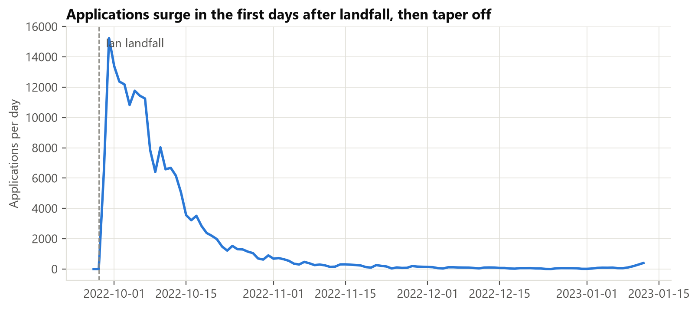
*Figure 2.1. Daily applications; the peak is Sep 30, 2022.*

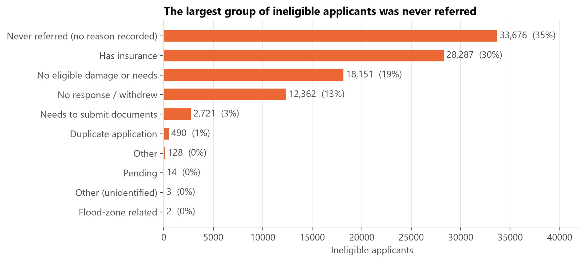
*Figure 2.2. Why applicants were not awarded aid.*

**The question our model answers:** *Given what we know about an applicant, will FEMA award them IHP aid?*

**Why it matters.** Applicants wait for answers while caseworkers are overloaded. A reliable prediction could help FEMA:
- (a) route likely eligible applications to fast track;
- (b) flag applications that are likely ineligible early, so staff can tell people what is missing (for example, insurance documents);
- (c) decide where to send inspectors first;
- (d) plan staffing and budget for the next disaster.

**What it is not.** The model is decision *support*. It must never automatically deny anyone aid. A person makes every final decision.

### 2.2 Business objectives and success criteria
| Objective | How we will measure it | Proposed target  |
|---|---|---|
| Predict if someone gets aid right when they apply (Tier 1) | ROC-AUC and F1 on the held-out test set | Beat the untuned baseline: ROC-AUC ≥ 0.90, F1 ≥ 0.91 |
| Predict if someone gets aid after the inspection (Tier 2) | Same as above | ROC-AUC ≥ 0.94 |
| Do better than the simple approaches | Compare against just guessing the majority class and against logistic regression | Clearly beat both (guessing the majority class gets 50.7% accuracy; the logistic-regression reference is re-run on the verified data, see Section 5.1) |
| Be fair to every group | Error rates for each age band and income band | No group's error rate is more than 5 percentage points above the overall rate |
| Be explainable | Feature-importance and partial-dependence plots that a caseworker could actually read | The main drivers line up with FEMA's own eligibility rules |

*Note.* These targets were set from earlier untuned baselines that must be re-run on the verified data (Section 5.1) before they are confirmed. They are goals for the tuned models, not promises.

### 2.3 Stakeholder analysis
| Stakeholder | Interest | Cost of a wrong prediction |
|---|---|---|
| Applicants (survivors) | Quick and fair decisions that they can understand | A household wrongly flagged as "ineligible" (a **false negative**) might just give up on a claim they deserve |
| FEMA caseworkers and program managers | Getting through applications fast and accurately, with decisions they can defend | Wasted inspections (**false positives**), or eligible people getting missed |
| Lee County emergency management, State of Florida | Faster recovery and being able to plan their resources | Misjudging how much help is needed |
| Congress, auditors, taxpayers | Federal money being used properly | Improper payments or denials that nobody can explain |
| Equity and legal-aid organizations | No group being treated worse than another | Bias against certain ages, income levels, or places |
| Our team / instructor | A solid method and honest reporting | n/a |

### 2.4 Expected impact and value proposition
A tuned, audited model would give FEMA an explainable signal at registration that also comes in early, when information is cheapest to act on. Its value is speed and prioritization, not replacing judgment. Because the outcome depends partially on FEMA's own screening rules, the model also works as a *consistency check*: applications where the model strongly disagrees with the outcome deserve a second check.

### 2.5 Risks and assumptions
- **Selection bias:** only *valid* registrations are in the data, so we can say nothing about invalid applications.
- **Scope / generalization:** one storm and one county, so results may not transfer to other disasters.
- **Label noise:** "not eligible" mixes many reasons (insurance, missing documents, withdrawal, never referred).
- **Fairness:** age, income, and location can correlate with vulnerable groups, so we will audit error rates by group.
- The flat $700 payment (confirmed): the $700 award is FEMA's *Serious Needs Assistance*, a one time and flexible payment per household for urgent needs: food, water, and medication, approved soon after registration (FEMA, *Serious Needs Assistance* fact sheet). Because it can be approved early and follows a simple rule, part of what our model learns is this screening part.

---

## 3. Data Understanding *(3–4 pages · 7 pts)*

> ✏️ **Owner note.** This is the highest-weighted section. The story runs in the order a grader checks: **what the data is → what we predict → what we must not use → what it looks like → how its parts relate → what's wrong with it → what that means for modeling.** Every subsection ends with an "overall" sentence that links the finding to a modeling decision, the bridge into Section 4.

Full analysis: `notebooks/eda/01_initial_eda.ipynb` (exported as `reports/milestone_1/eda_notebook.html`). Column-by-column definitions: `docs/data_dictionary.md` (Appendix A).

### 3.1 Dataset description and source

Our data comes from FEMA's *Individuals and Households Program – Valid Registrations (v2)*, a public government dataset drawn from FEMA's National Emergency Management Information System (NEMIS). We downloaded the data from FEMA's public data site using our script `src/data/fetch_fema.py`, keeping it to Hurricane Ian (DR-4673) and to applicants in Lee County. The size of the data is 194,482 rows by 100 columns, with applications dated 2022-09-27 to 2023-01-12, and it has both numeric and categorical columns. One row is one household's application, which is our unit of observation. FEMA warns that this is raw data that has human error. It includes only valid registrations. Overall, the dataset is large enough for k-fold cross-validation with plenty of rows in every fold, but because it covers a single disaster, it limits generalization.

### 3.2 The target variable

Our target is `ihpEligible`, which is True when FEMA awarded the household housing and/or other-needs aid. Whether or not FEMA gives a household aid, yes or no, is the answer our model tries to predict. The classes are almost even, with 98,648 eligible (50.7%) and 95,834 not eligible (49.3%) (Figure D.1). Overall, about half got aid and half didn't, so the accuracy is a fair score and no SMOTE is required for this dataset. Each piece of the data we train and test on is stratified, so it keeps that same 50.7 / 49.3 mix.

### 3.3 Feature roles and data leakage (our key finding)

We sorted all 100 columns into roles, recorded in `src/utils/columns.py`, which is the one file the whole team uses for this:

| Role | Columns | Meaning |
|---|---|---|
| Target | 1 | `ihpEligible` |
| Tier 1: application-time | 26 | Self-reported at registration |
| Tier 2: later-stage | 14 | Learned after inspection or verification |
| Leakage | 43 | Results of the decision; never used |
| ID / constant | 15 | Identifiers, or identical on every row |
| Under review | 1 | `utilitiesOut`, held out of both tiers for now |

Tier 1 has 26 columns, but only 25 features, because `damagedCity` gets dropped and `appliedDate` turns into `daysSinceLandfall`. Tier 2 is Tier 1 with an additional 14 columns, resulting in 39 features total. We're not using `utilitiesOut` yet. It's almost never blank, but when it is, nearly everyone gets approved. That's suspicious and looks like leakage, as it is blank for only 2.7% of rows, but 99.9% of those rows were approved.

We checked each column one at a time to see how closely it matches the answer (Figure 3.1). The score is called Cramér's V, where 0 is no match and 1 is a perfect match. Three columns that are results of FEMA's decision score very high: `ihpAmount` 1.00, `onaEligible` 0.95, `ineligibleReason` 0.70. However, the best normal column only gets 0.46, so anything scoring near 1 is leakage.

The borderline case is the `currentLocation` variable. It includes things that happen because of aid ("FEMA-provided unit" is 99% eligible), so it was moved from Tier 1 to Tier 2 to keep the model honest. Overall, a good score only means something if the model uses information that would actually be available when the prediction is made, which is why we split the features into two tiers.

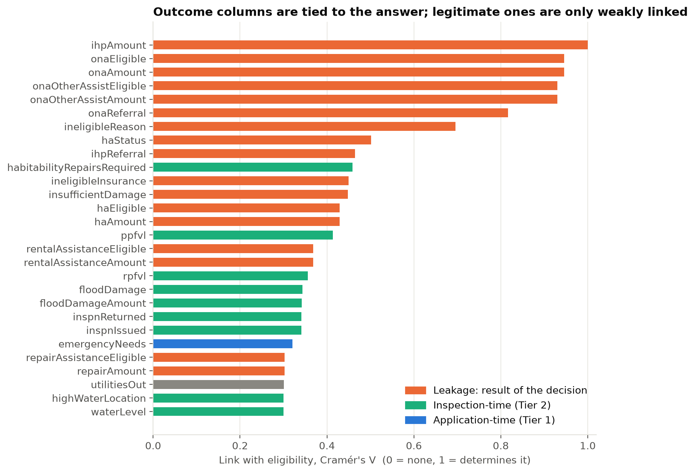
*Figure 3.1. Each column's link with eligibility (Cramér's V). Leakage columns sit at the top.*

### 3.4 Summary statistics and distributions

Most applicants were older people in small households who owned their homes and applied online: 57% are 50 or older, most households have one or two people, 64% own their home, and 77% registered online or through the mobile app (Figure D.2). The damage numbers are skewed. `rpfvl`, the real-property loss FEMA verified, is $0 for about 83% of applicants, and the other 17% are spread out with some very large amounts. ZIP code has high cardinality, with about 560 different values, which is too many to give each one its own column. Overall, we log transform the damage columns to shrink the skew and add a yes/no "has damage" flag, and we frequency-encode ZIP codes instead of giving each ZIP its own column.

### 3.5 Relationships with the target

Some features change the chance of approval a lot (Figure 3.2). If the home isn't the applicant's primary residence, they are basically never approved (about 0.4%). Reporting emergency needs makes approval more likely (66% vs. 34%). Having homeowners insurance makes it less likely (47% vs. 55%), since FEMA doesn't pay for damage that insurance already covers. Higher income also lowers the odds, from 61% under $15k to 45% above $175k, although the $0-income group is the lowest at 42%. At Tier 2, applicants whose inspection was completed were approved 73% of the time versus 38% otherwise. Approval also varies by ZIP code, and it falls from 65% for people who applied in the first week after landfall to 19% by week 5 (Figures D.3 and D.4). Overall, several of the strongest signals work more like yes/no rules than gradual trends, so tree-based models such as decision trees and random forests should fit this data well. Income stays an unordered category, because the $0 group breaks the usual "more income, less aid" pattern.

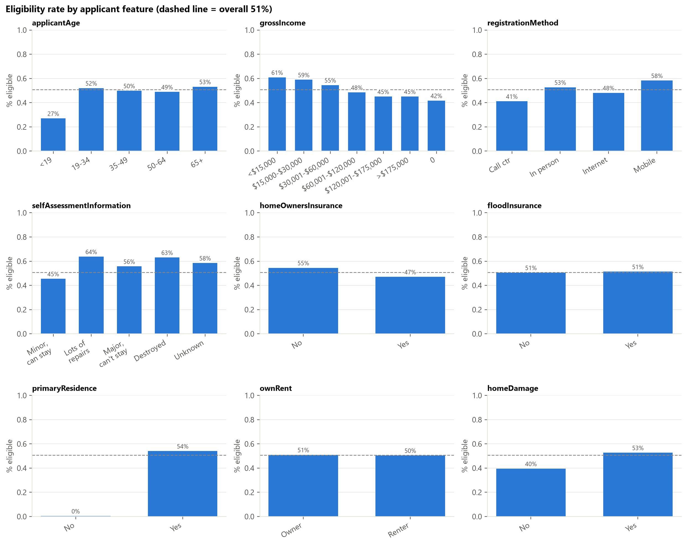
*Figure 3.2. Eligibility rate within each category of key features.*

### 3.6 Missing values

Nineteen columns have missing values. Eleven of them are columns we could use as features, and six are more than 10% missing (Figure D.7):

| Column | Missing | Likely reason it's blank |
|---|---|---|
| `renterDamageLevel` | 96% | Only applies to renters |
| `highWaterLocation` | 88% | Only applies where there was a flood mark |
| `shelterNeed` | 82% | Almost always "yes" when filled in, so blank ≈ not reported |
| `habitabilityRepairsRequired` | 73% | Not filled in for most applicants (reason not confirmed) |
| `foodNeed` | 52% | Almost always "yes" when filled in, so blank ≈ not reported |
| `selfAssessmentInformation` | 15% | Applicant's own damage rating, left blank by some |

Many of these blanks mean something, so the data is not missing completely at random. Overall, filling the blanks with an average would throw away that information, so we add a yes/no "was this blank?" column for these features, and fill any remaining gaps inside the pipeline using only the training data.

### 3.7 Correlation analysis

No single numeric feature has a strong straight-line relationship with approval. The strongest correlation is only about 0.36 (Figure D.5). Not a single column predicts the answer confidently alone, so the model will probably need several columns working together, which will be tested in Milestone 2. Some features are near-copies of each other (Figure D.6): inspection issued vs. inspection completed (1.00), verified home damage vs. flood damage amount (0.97), and reported damage vs. home damage (0.83). Overall, the near-copy pairs are multicollinearity, so we drop one from each pair for linear models like logistic regression, while tree-based models can keep both.

### 3.8 Data quality assessment

| Check | What we found | What we do |
|---|---|---|
| Constant columns | 14 columns have the same value on every row (one disaster, one county) | Drop them |
| Duplicates | 407 rows (0.21%) match on every non-ID column, likely different households with the same answers | Keep them |
| Location errors | 6,357 rows (3.3%) have a census block outside Lee County (2,707 are `NO_INTERSECT`); only 17 have a non-Florida ZIP | Keep them; treat `NO_INTERSECT` as its own category |
| Hand-typed city names | Many spellings (`FT MYERS`, `FT MYERS BCH`) | Drop the city column |
| Impossible values | A flood depth of 960 inches (80 feet) | Cap it at a reasonable max |
| Dates | Only 2 applications dated before the disaster was declared | Keep them |

Overall, the data quality is good, and every problem has a specific fix that carries into the Data Preparation Plan (Section 4).

### 3.9 Challenges and limitations

Leakage, skew, meaningful blanks, and near-copy features are covered above. The remaining limits are:

| Challenge | Why it matters for the model |
|---|---|
| One storm, one county | A model trained here may not work for other disasters (generalization) |
| Valid registrations only | Selection bias: we can't say anything about applications that never made it in |
| "Not eligible" covers many reasons | Label noise: one "no" can mean very different things |
| Approval partly follows FEMA's own rules | A high score doesn't prove the model understands who actually needs help |

Overall, none of these issues bring the project to a halt, but it does affect how we build/score the model. Sections 4 and 5 explain how we deal with them.

---

## 4. Data Preparation Plan *(2–3 pages · 3 pts)*

> ✏️ **Owner note.** Each row in 4.1 should answer a problem raised in Section 3. The cleaning code already exists and is shared: `src/features/prepare.py`.

### 4.1 Data cleaning strategy
| Issue (from §3) | Decision |
|---|---|
| Leakage, IDs, constants (58 columns) | Drop (listed in §3.3) |
| `utilitiesOut` (under review) | Hold out of both tiers until FEMA confirms when it is filled in (§3.6) |
| `damagedCity` (hand-typed) | Drop; use ZIP and census block instead |
| Yes/No columns stored as text with blanks | Convert to 0/1; keep blanks as truly missing (not 0) |
| Ordered ranges (`applicantAge`, household counts) | **Ordinal encoding** (`>5` becomes 6) |
| Income bracket | Keep as an unordered category (the "$0" group breaks the ordering) |
| Missing values | Do **not** fill in during cleaning. Use missing indicators plus median imputation (linear models) or native handling (boosting), fit on training data only |
| Implausible values (`waterLevel` = 960 in) | Cap at a high percentile |
| Out-of-county blocks | Keep; treat `NO_INTERSECT` as its own category |
| Duplicate-looking rows | Keep (see §3.8) |

### 4.2 Feature engineering
- `daysSinceLandfall` from the application date (already built).
- **Log transform** (`log1p`) of the skewed dollar and damage columns, plus "has damage" yes/no flags.
- **Missing-value indicators** for the columns whose blanks carry meaning.
- ZIP and census block: **frequency encoding** first, with **target encoding** tested *inside* cross-validation folds.
- Group rare categories together; drop one of each near-duplicate pair for linear models.
- Possible **interaction features**, such as emergency needs × primary residence, to test in Milestone 2.

### 4.3 Data transformation
**Scaling** (standardization) and **one-hot encoding** are applied only for models that need them (logistic regression, and any distance-based method). Tree-based models use the unscaled data. **Every transformation that learns from data (imputation, scaling, encoding) is fit on the training split only**, inside a scikit-learn `Pipeline`, to prevent a second kind of leakage (**train–test contamination**).

### 4.4 Train / validation / test strategy
- **Stratified split, 60% train / 20% validation / 20% test**, with fixed random seed 42 so everyone gets the same split. Each part keeps the same 50.7% / 49.3% mix. Implemented in `split_data()`.
- **The test set is touched once**, at the very end of Milestone 2.
- Cross-validation (Section 5.3) uses the 80% development set (train + validation); the 20% test set stays sealed.
- **Robustness check (temporal validation):** because applications arrive over time, we will also train on early applicants and test on later ones to see whether performance holds up.
- We cannot link applications from the same household, so we note this as a limitation.

---

## 5. Modeling Approach *(2–3 pages)*

> ✏️ **Owner note.** Justify each model by a property of *our* data from Section 3 (skew, interactions, rule-like signals), not by general reputation.

### 5.1 Algorithm selection and justification
| Model | Why it fits this data |
|---|---|
| Logistic regression | Simple, fast, interpretable coefficients; the baseline to beat |
| Decision tree | Human-readable rules, and FEMA's process is rule-like |
| Random forest | Robust to skew, mixed types, and outliers; bagging reduces a single tree's **variance** (overfitting) |
| Gradient boosting | Captures the feature interactions suggested in §3.7 and the rule-like thresholds in §3.5 |
| [TEAM: add or remove models based on what the course has covered, e.g. k-NN or a neural network] | |

**Baselines are not yet re-run on the verified data.** The earlier untuned results came from `src/models/baseline.py` on an earlier download, and the EDA notebook no longer reproduces them. [TEAM: re-run the baselines on the verified data and insert ROC-AUC, accuracy, and F1 for Tier 1 and Tier 2 here.]

| Reference | ROC-AUC | Accuracy | F1 |
|---|---|---|---|
| Always guess the majority class (50.7% eligible) | 0.500 | 0.507 | 0.000 |

### 5.2 Evaluation metrics
| Metric | Why we use it |
|---|---|
| **ROC-AUC** (primary) | Measures ranking quality regardless of the decision threshold; suitable because the classes are balanced |
| **Precision, Recall, F1** | A false "ineligible" and a false "eligible" have different real-world costs, so we report both and choose the **decision threshold** explicitly |
| **Accuracy** | Fair here because of the class balance |
| **Confusion matrix** | Shows exactly where the errors fall |
| **Group error rates** (age, income) | Fairness audit (target in §2.2) |

### 5.3 Cross-validation and hyperparameter tuning
Five-fold **stratified cross-validation** on the development set. **Randomized hyperparameter search** runs inside the folds. Every model uses the same folds so comparisons are fair. The test set is used once, for the final score.

### 5.4 Expected challenges and mitigation
| Challenge | Mitigation |
|---|---|
| Hidden leakage as scores get high | Keep the roles file as the single source of truth; repeat the "drop a feature group and see what moves" **ablation study** for every final feature set (the EDA's location check is what moved `currentLocation` out of Tier 1) |
| Very high-cardinality geography | Frequency / target encoding fit inside folds; compare with and without |
| Skewed, mostly-zero damage columns | Log transform plus flags; prefer tree models |
| Model just re-learns FEMA's rules | Say so honestly; report cases where the model disagrees with outcomes as the interesting ones |
| Fairness across age / income / place | Report group error rates; investigate any gap over 5 points |
| Results specific to one storm | State the scope; run the temporal robustness check |

---

## 6. Project Timeline *(1 page)*

> ✏️ **Owner note.** Fill every `[TEAM]` owner cell with a name before export. The internal deadlines for this week are in the team responsibilities doc.

| Dates | Work | Owner |
|---|---|---|
| Sep 22–25 | Team meeting: agree on the target, success criteria, and roles; each member re-runs the EDA notebook and reads the data dictionary | All |
| Sep 26–29 | Finalize and proofread the report; export to PDF; assemble `TeamName_Milestone1_YYYYMMDD.zip` | [TEAM] |
| **Sep 30** | **Milestone 1 due** | All |
| Oct 1–14 | Finish the preprocessing pipeline (feature engineering, encoders) and the `notebooks/preprocessing` notebook | [TEAM] |
| Oct 15–31 | Train all models, cross-validate, tune hyperparameters | [TEAM] |
| Nov 1–10 | Evaluation: model comparison, interpretation (feature importance), leakage ablations, fairness audit | [TEAM] |
| Nov 11–18 | Write the final report; build the presentation; rehearse | All |
| Nov 19 | Internal freeze: code runs top to bottom, PDF exported | All |
| **Nov 21** | **Milestone 2 due** | All |
| **Nov 23 / Dec 2** | **Presentation (15 min + Q&A)** | All |

**Team responsibilities.** [TEAM: name] data and EDA | [TEAM: name] modeling | [TEAM: name] evaluation and report. Everyone contributes to every phase and attends the presentation.

**Risks and contingencies**
| Risk | Contingency |
|---|---|
| A teammate is unavailable | Everything is in Git with documented code, so work can be picked up; weekly check-ins |
| Scores drop below the baseline after removing leaky features | Report honestly; the leakage-removal story is itself a finding |
| Merge conflicts in shared notebooks | One person per notebook at a time; small commits; pull before starting |
| Running out of time before Nov 21 | Freeze the model set by Oct 31; drop optional models first |

---

## Appendices *(not counted in the page limit)*
- A. Data dictionary (`docs/data_dictionary.md`)
- B. EDA notebook export (`reports/milestone_1/eda_notebook.html`)
- C. AI usage log (`docs/AI_USAGE.md`)
- D. Additional figures (`reports/figures/`)

### Appendix D. Additional figures for Section 3

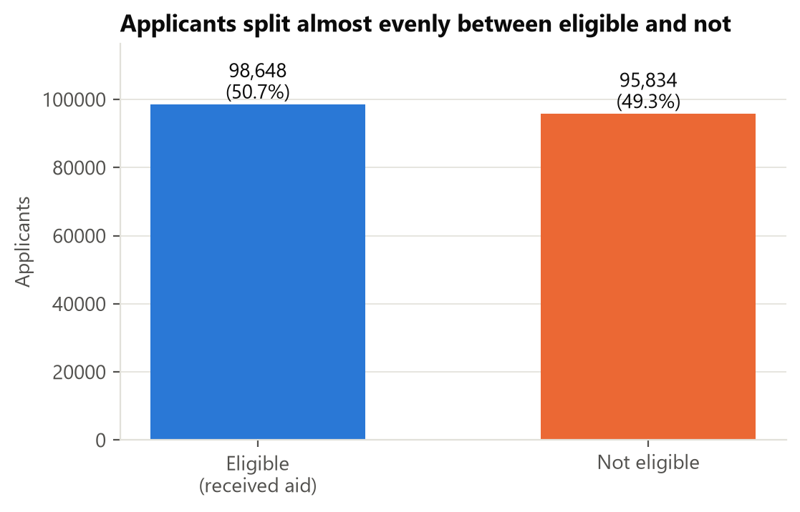
*Figure D.1. Class balance of `ihpEligible`.*

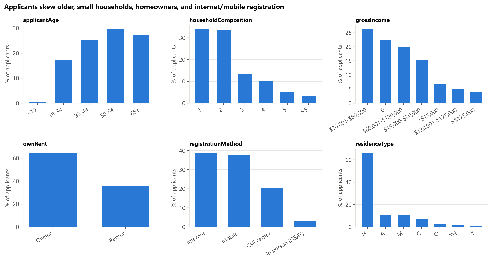
*Figure D.2. Age, household size, ownership, and registration method.*

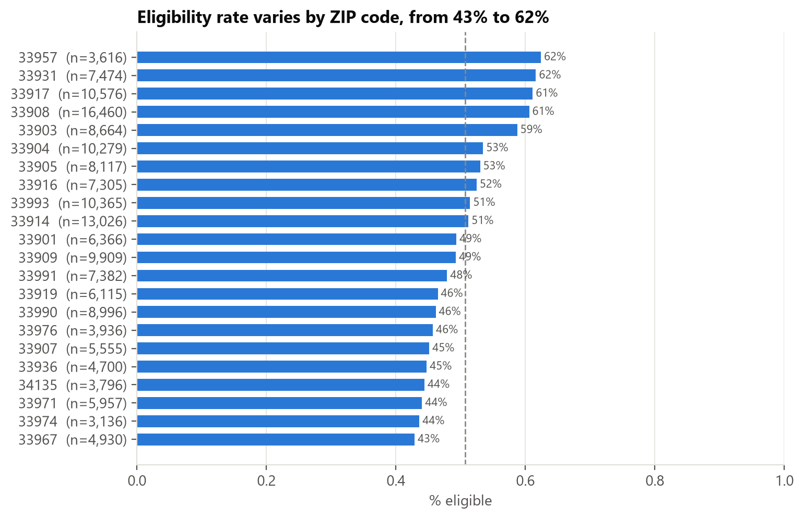
*Figure D.3. Eligibility across the 22 largest ZIP codes.*

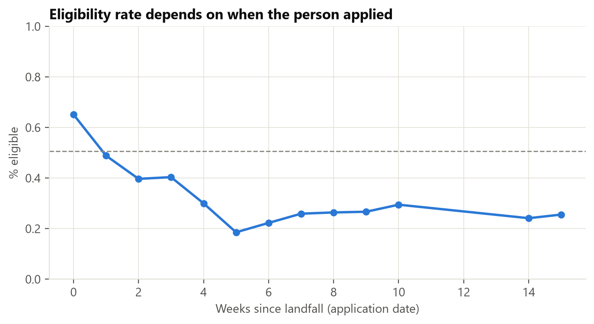
*Figure D.4. Eligibility by week of application.*

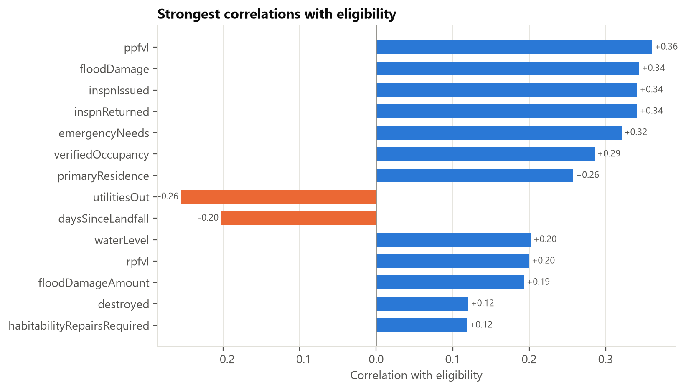
*Figure D.5. Correlation of each numeric feature with the target.*

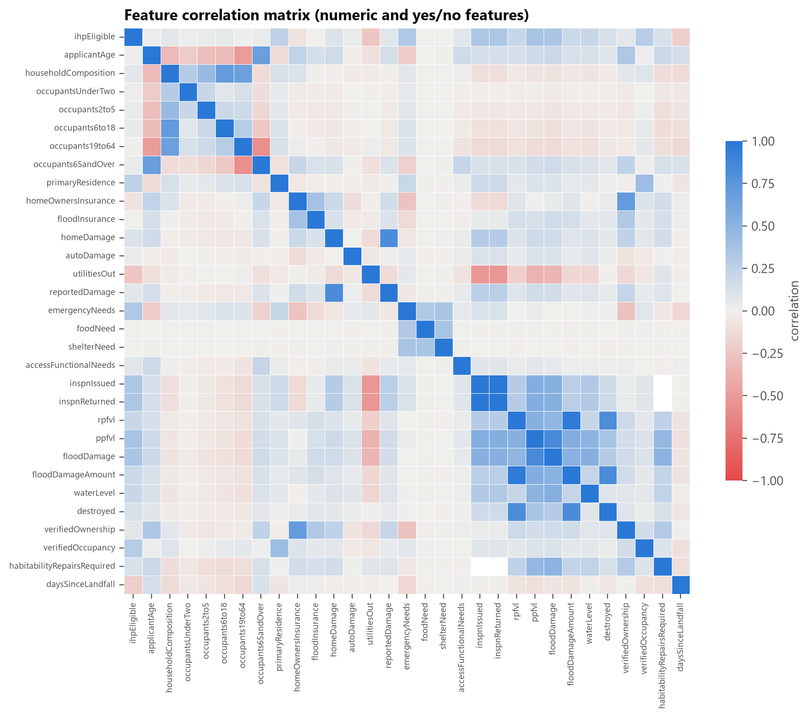
*Figure D.6. Feature-to-feature correlations.*

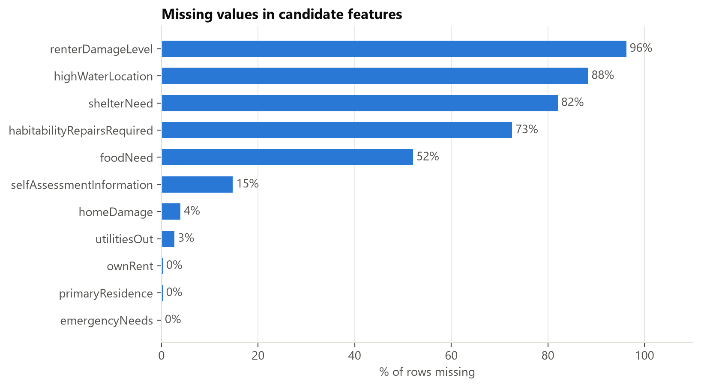
*Figure D.7. Share of missing values per column.*

## References
FEMA. *OpenFEMA Dataset: Individuals and Households Program – Valid Registrations v2.* https://www.fema.gov/openfema-data-page/individuals-and-households-program-valid-registrations-v2

FEMA. *Serious Needs Assistance* (fact sheet). https://www.fema.gov/fact-sheet/serious-needs-assistance-0

## AI-use disclosure
Portions of the code, analysis, and this draft were produced with Claude Code (Anthropic) and reviewed by the team. See `docs/AI_USAGE.md` for the full log.
